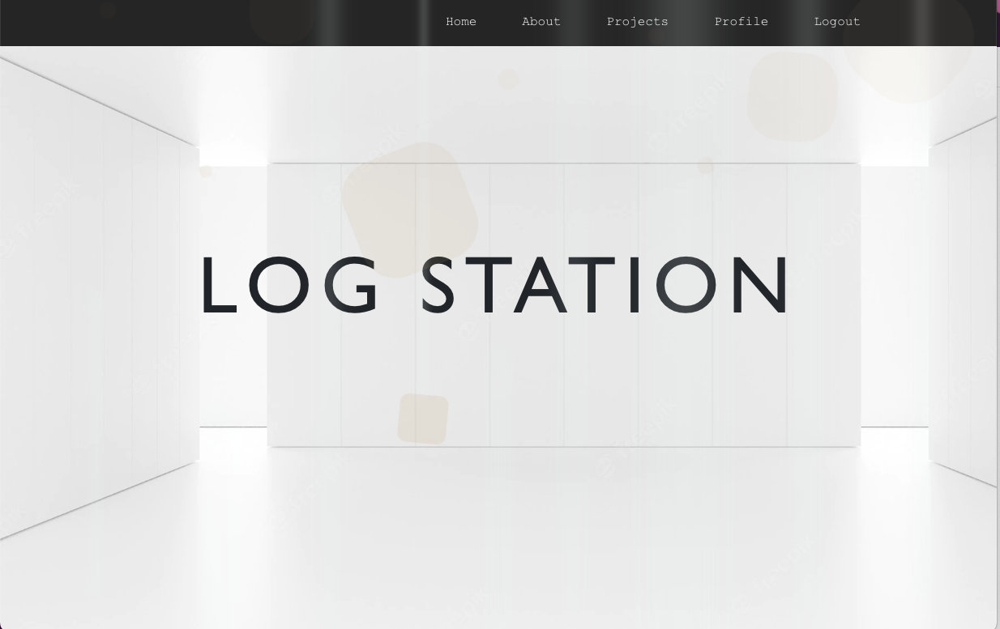
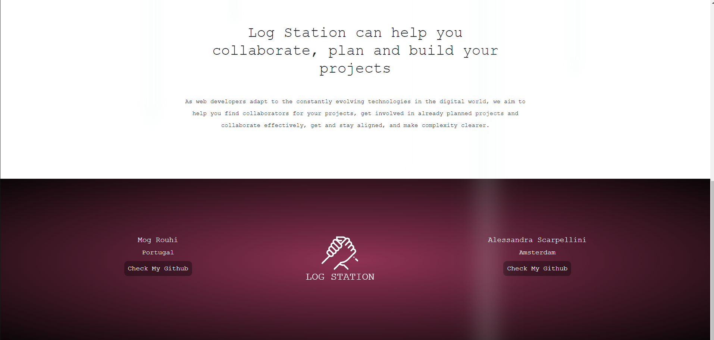
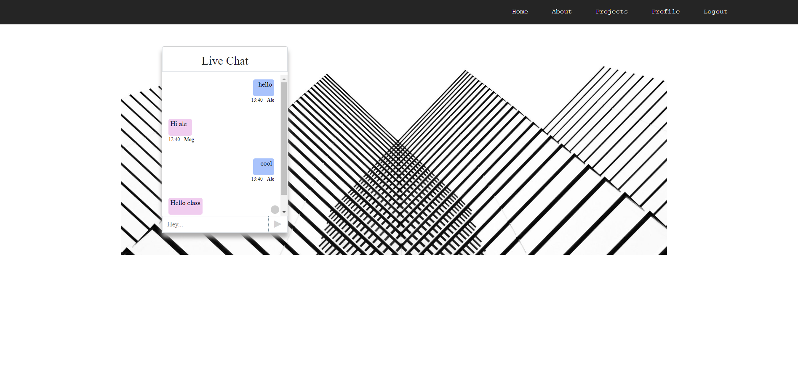

# LOG STATION

Log Station is a platform for web developers who want to: 
- show projects they developed
- share projects they are working on
- present ideas of projects they'd like to develop
- CONTACT OTHER DEVELOPERS THEY'D LIKE TO COLLABORATE WITH!

## Installation

This project was build with [ironlauncher!](https://www.npmjs.com/package/ironlauncher)


```bash
npm install
```

## Other npm packages

```python

# Live-chat Websocket
npm i socket.io

# Cloudinary
npm i cloudinary multer multer-storage-cloudinary

```
## Environmental variable

TOKEN_SECRET

PORT

ORIGIN

CLOUDINARY_NAME --> Cloudinary 

CLOUDINARY_KEY

CLOUDINARY_SECRET


## Front-end
 
Front-end repository --> [log-station-client](https://github.com/italian-iranian-connection/log-station-client)

Project hosted on Netlify --> [Log Station](https://logstation.netlify.app)

## Visit the website!
[DEMO DEPLOYED ON NETLIFY!](https://logstation.netlify.app)

##




[](https://deploy.cyclic.sh/)
